Week02 Homework Answer
======================

@yfaming, 2020.08.23 周日

# homework
分值：300

题目描述：

使用 sysbench、go-ycsb 和 go-tpc 分别对
 TiDB 进行测试并且产出测试报告。

测试报告需要包括以下内容：

* 部署环境的机器配置(CPU、内存、磁盘规格型号)，拓扑结构(TiDB、TiKV 各部署于哪些节点)
* 调整过后的 TiDB 和 TiKV 配置
* 测试输出结果
* 关键指标的监控截图
	    * TiDB Query Summary 中的 qps 与 duration
	    * TiKV Details 面板中 Cluster 中各 server 的 CPU 以及 QPS 指标
	    * TiKV Details 面板中 grpc 的 qps 以及 duration

输出：写出你对该配置与拓扑环境和 workload 下 TiDB 集群负载的分析，提出你认为的 TiDB 的性能的瓶颈所在(能提出大致在哪个模块即 可)

截止时间：下周二（8.25）24:00:00(逾期提交不给分)

# 机器配置
从 digitalOcean 购买 5 台虚拟机，配置统一，如下：
* 8 CPU
* 32GB RAM
* 640GB SSD

IP 如下:
```
165.22.251.205 tibench-01
165.22.251.238 tibench-02
165.22.253.1   tibench-03
165.22.253.4   tibench-04
# tibench-05 missing
165.22.253.27  tibench-06
```
(本想购买 6 台机器，但只成功 5 台，重试多次皆不行，只好放弃)

# 拓扑结构
```
PD: 1 节点, tibench-01
TiDB: 1 节点, tibench-06
TiKV: 3 节点, tibench-02, tibench-03, tibench-04
```

# 调整后的 TiDB & TiKV 配置
无调整

# topology.yaml
```yaml
global:
  user: "root"
  ssh_port: 22
  deploy_dir: "/tidb-deploy"
  data_dir: "/tidb-data"

pd_servers:
  - host: 165.22.251.205

tidb_servers:
  - host: 165.22.253.27

tikv_servers:
  - host: 165.22.251.238
  - host: 165.22.253.1
  - host: 165.22.253.4

monitoring_servers:
  - host: 165.22.251.205

grafana_servers:
  - host: 165.22.251.205

alertmanager_servers:
  - host: 165.22.251.205
```

# sysbench
sysbench 测试发现导数据非常之慢，最终统一采用 10 个表，每个表 1 百万条数据的配置。`--tables=10 --table-size=1000000`

## oltp_point_select
thread 数量从默认 8 个逐步调大到 48，QPS 从 1w+ 逐步达到 3w 左右，而延迟从 0.9ms 逐步上涨到 2.5ms 左右。

摘录的 sysbench 日志：
```
[ 60s ] thds: 8 tps: 11604.40 qps: 11604.40 (r/w/o: 11604.40/0.00/0.00) lat (ms,95%): 0.99 err/s: 0.00 reconn/s: 0.00
[ 60s ] thds: 16 tps: 20872.68 qps: 20872.68 (r/w/o: 20872.68/0.00/0.00) lat (ms,95%): 1.18 err/s: 0.00 reconn/s: 0.00
[ 60s ] thds: 32 tps: 29405.26 qps: 29405.26 (r/w/o: 29405.26/0.00/0.00) lat (ms,95%): 1.73 err/s: 0.00 reconn/s: 0.00
[ 60s ] thds: 48 tps: 33695.24 qps: 33695.24 (r/w/o: 33695.24/0.00/0.00) lat (ms,95%): 2.30 err/s: 0.00 reconn/s: 0.00
```

监控截图:
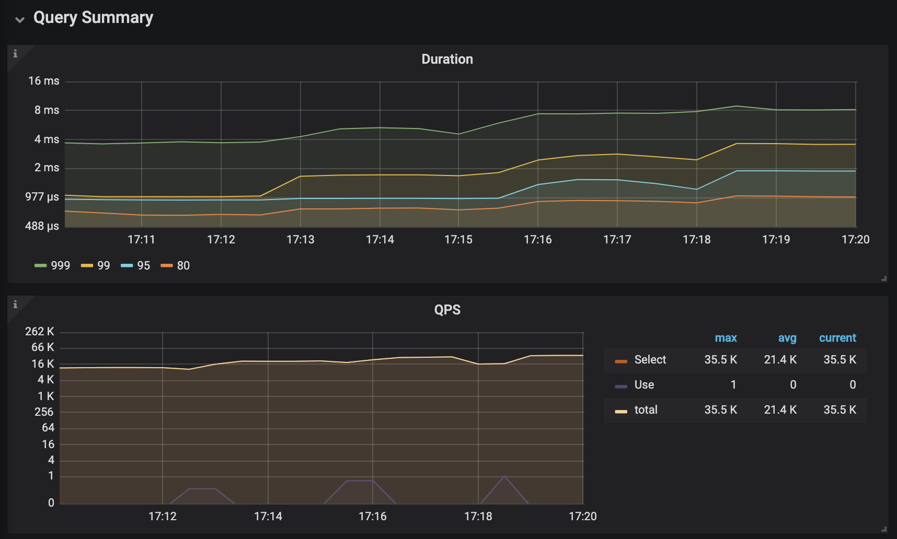
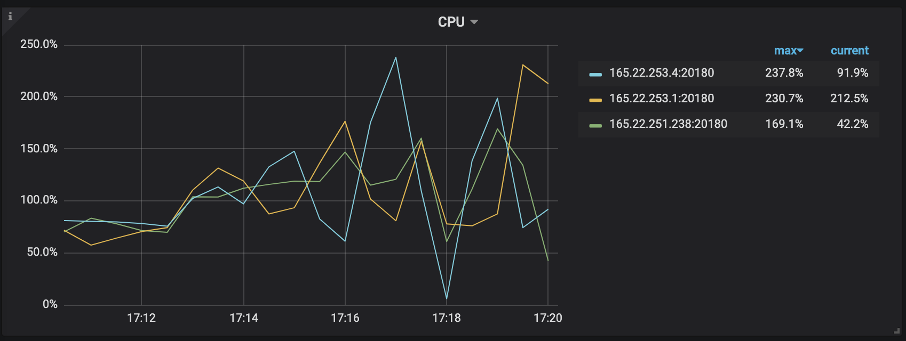
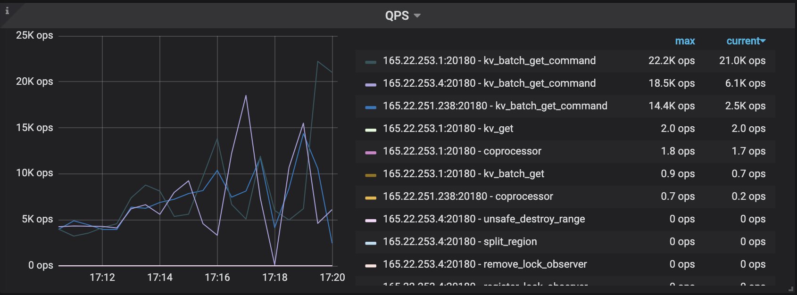
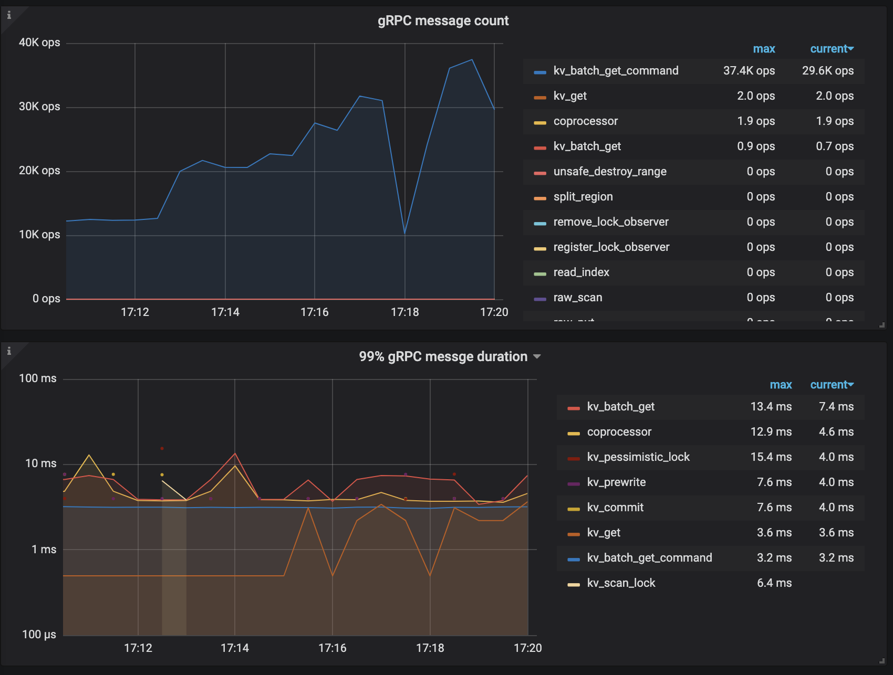

瓶颈可能在于 TiDB 的内存与 CPU 上。


## oltp_insert
thread 数量从 8 个逐步调大到 64，QPS 从 300+ 上升到 2500。
```
[ 60s ] thds: 8 tps: 376.60 qps: 376.60 (r/w/o: 0.00/376.60/0.00) lat (ms,95%): 47.47 err/s: 0.00 reconn/s: 0.00
[ 120s ] thds: 16 tps: 495.30 qps: 495.30 (r/w/o: 0.00/495.30/0.00) lat (ms,95%): 73.13 err/s: 0.00 reconn/s: 0.0
[ 120s ] thds: 32 tps: 1464.58 qps: 1464.58 (r/w/o: 0.00/1464.58/0.00) lat (ms,95%): 39.65 err/s: 0.00 reconn/s: 0.00
[ 120s ] thds: 48 tps: 1788.71 qps: 1788.71 (r/w/o: 0.00/1788.71/0.00) lat (ms,95%): 49.21 err/s: 0.00 reconn/s: 0.00
[ 120s ] thds: 64 tps: 2500.40 qps: 2500.40 (r/w/o: 0.00/2500.40/0.00) lat (ms,95%): 46.63 err/s: 0.00 reconn/s: 0.00
[ 120s ] thds: 96 tps: 2226.42 qps: 2226.42 (r/w/o: 0.00/2226.42/0.00) lat (ms,95%): 81.48 err/s: 0.00 reconn/s: 0.00
```
线程数调大之后，测得的 QPS 并不稳定，波动比较大。但 latency 比较稳定。达到 96 线程之后，latency 也不稳定了。

监控截图:
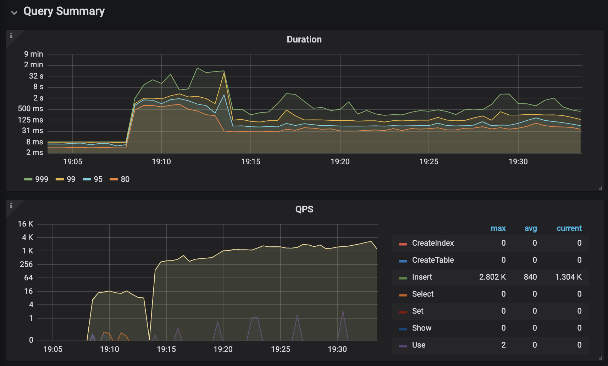
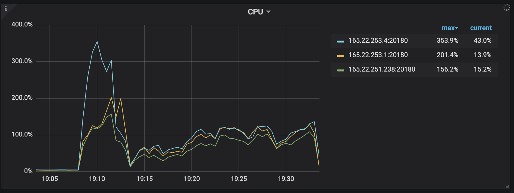

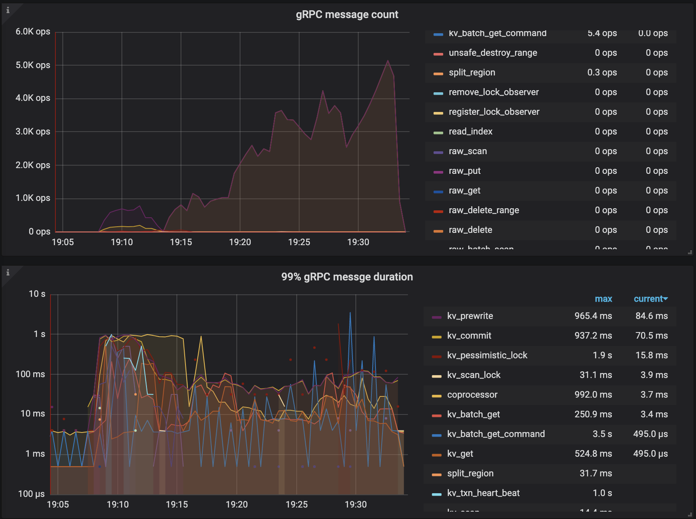

瓶颈可能在于 TiKV 上，可能与 RocksDB 或者 IO 有关。

## oltp_delete
thread 数量从 8 逐步调大到 64，QPS 从 659 上升到 11282。latency 稳定在 30ms 左右。
```
[ 120s ] thds: 8 tps: 659.33 qps: 659.33 (r/w/o: 0.00/439.92/219.41) lat (ms,95%): 31.37 err/s: 0.00 reconn/s: 0.00
[ 120s ] thds: 16 tps: 2087.29 qps: 2087.29 (r/w/o: 0.00/575.90/1511.39) lat (ms,95%): 33.72 err/s: 0.00 reconn/s: 0.00
[ 120s ] thds: 32 tps: 4639.11 qps: 4639.11 (r/w/o: 0.00/1029.90/3609.21) lat (ms,95%): 29.72 err/s: 0.00 reconn/s: 0.00
[ 120s ] thds: 64 tps: 11282.70 qps: 11282.70 (r/w/o: 0.00/2226.38/9056.32) lat (ms,95%): 21.50 err/s: 0.00 reconn/s: 0.00
```
想不到同等条件下，支持的 delete 的 qps 是 insert 的好几倍。

监控截图:
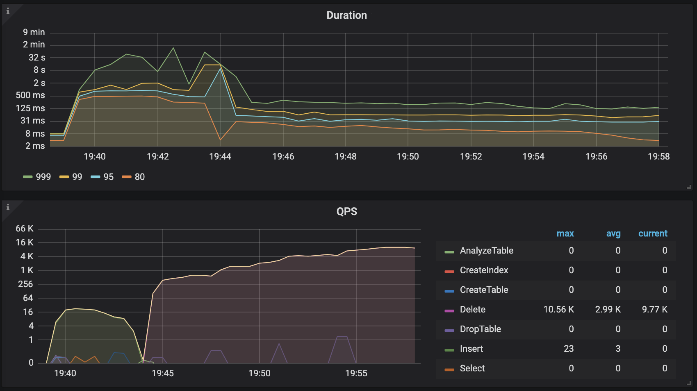
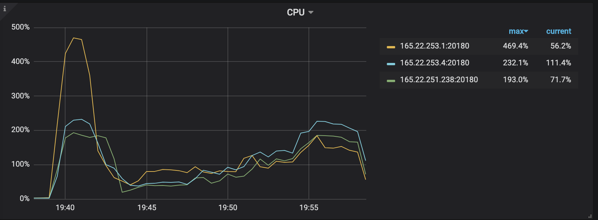
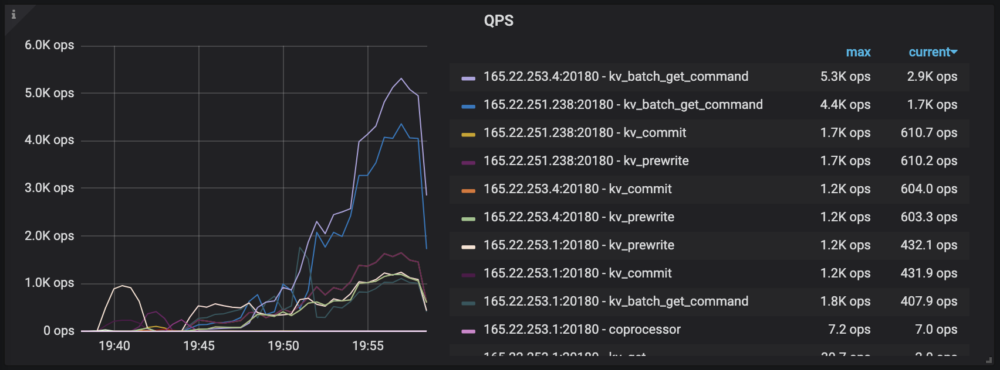
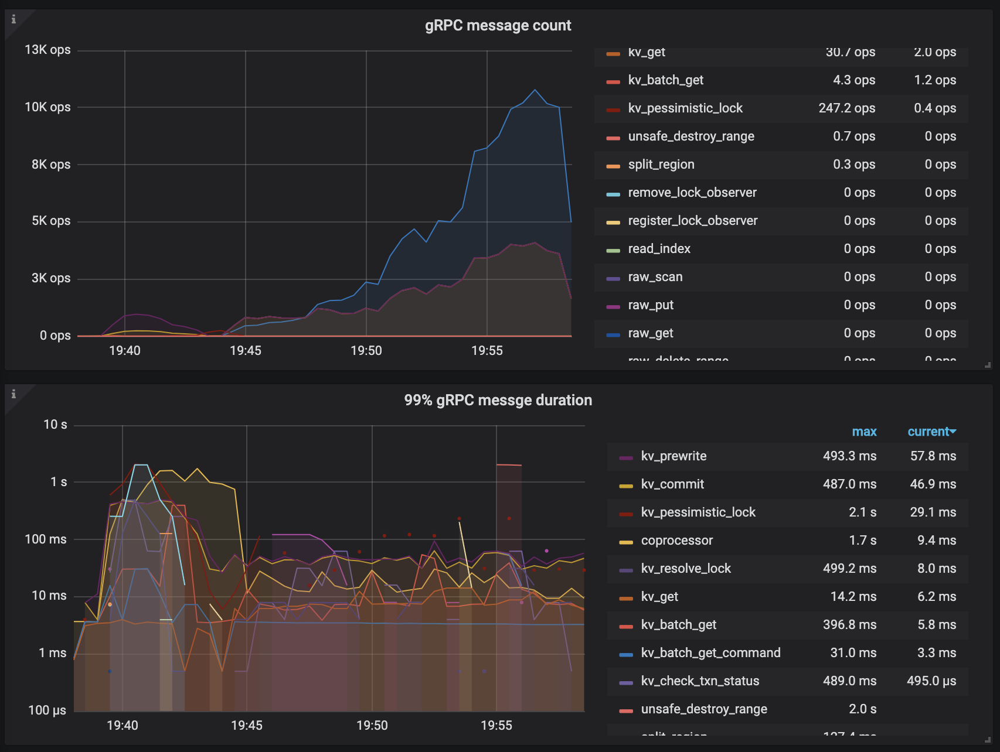
瓶颈可能在于 TiKV 上，可能与 RocksDB 或者 IO 有关。

## oltp_update_index
thread 数量从 8 调大到 64，QPS 从 174 上升到 9141。
```
[ 120s ] thds: 8 tps: 174.50 qps: 174.50 (r/w/o: 0.00/171.00/3.50) lat (ms,95%): 121.08 err/s: 0.00 reconn/s: 0.00
[ 120s ] thds: 16 tps: 420.50 qps: 420.50 (r/w/o: 0.00/413.20/7.30) lat (ms,95%): 101.13 err/s: 0.00 reconn/s: 0.00
[ 120s ] thds: 32 tps: 854.73 qps: 854.73 (r/w/o: 0.00/834.83/19.90) lat (ms,95%): 89.16 err/s: 0.00 reconn/s: 0.00
[ 120s ] thds: 64 tps: 1941.91 qps: 1941.91 (r/w/o: 0.00/1902.21/39.70) lat (ms,95%): 61.08 err/s: 0.00 reconn/s: 0.00
```

监控截图:
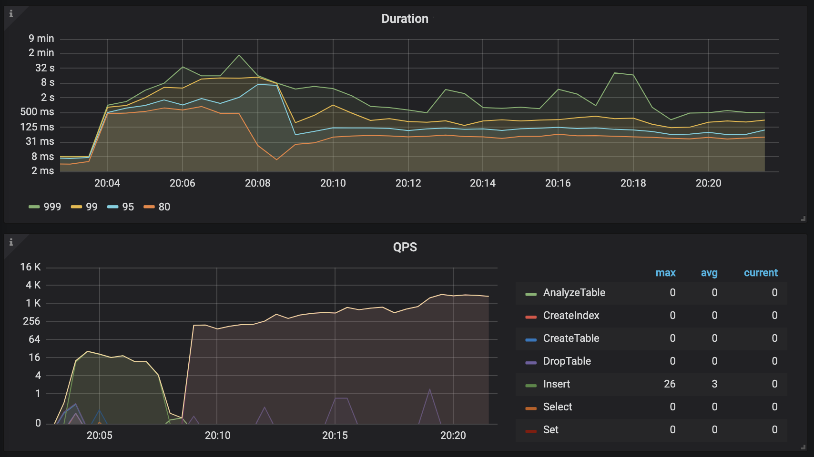
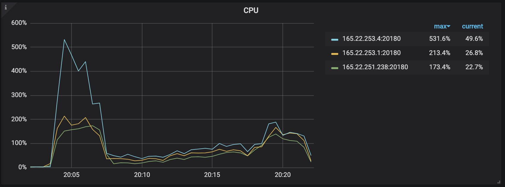
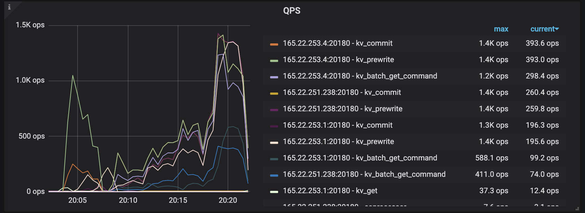
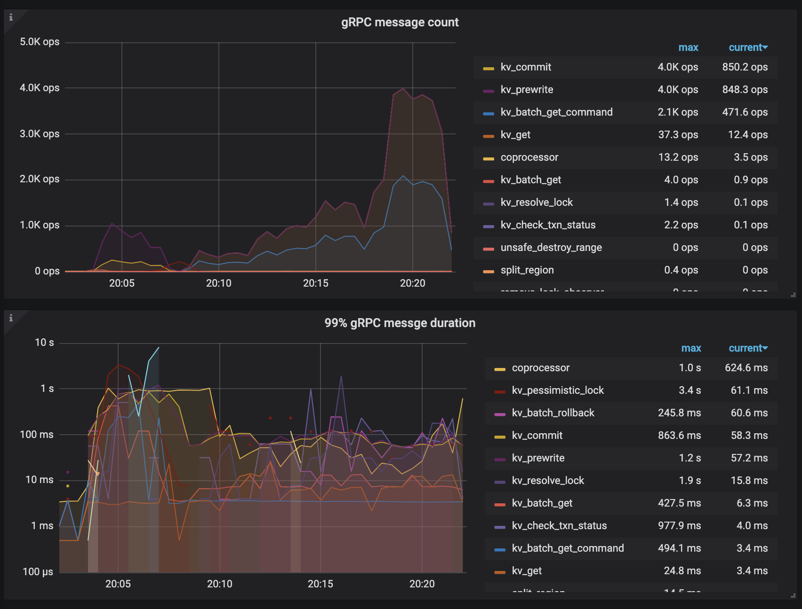
瓶颈可能在于 TiKV 上，可能与 RocksDB 或者 IO 有关。

## oltp_update_non_index
thread 数量从 8 调大到 64，QPS 从 408 上升到 2282。
```
[ 120s ] thds: 8 tps: 408.20 qps: 408.20 (r/w/o: 0.00/396.10/12.10) lat (ms,95%): 41.10 err/s: 0.00 reconn/s: 0.00
[ 120s ] thds: 16 tps: 596.60 qps: 596.60 (r/w/o: 0.00/577.10/19.50) lat (ms,95%): 68.05 err/s: 0.00 reconn/s: 0.00
[ 120s ] thds: 32 tps: 1502.20 qps: 1502.20 (r/w/o: 0.00/1461.80/40.40) lat (ms,95%): 47.47 err/s: 0.00 reconn/s: 0.00
[ 120s ] thds: 64 tps: 2282.99 qps: 2282.99 (r/w/o: 0.00/2215.89/67.10) lat (ms,95%): 62.19 err/s: 0.00 reconn/s: 0.00
```

监控截图:
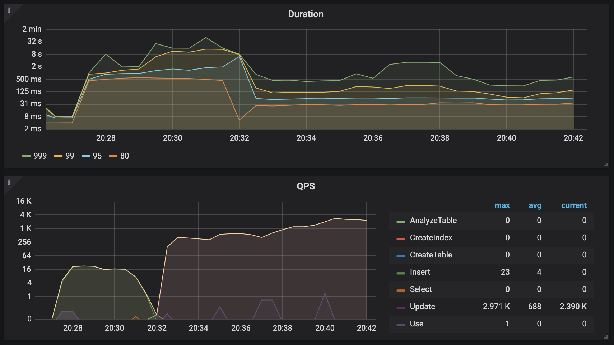
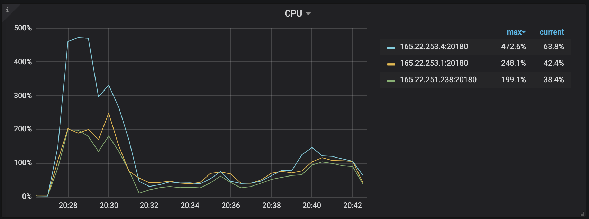
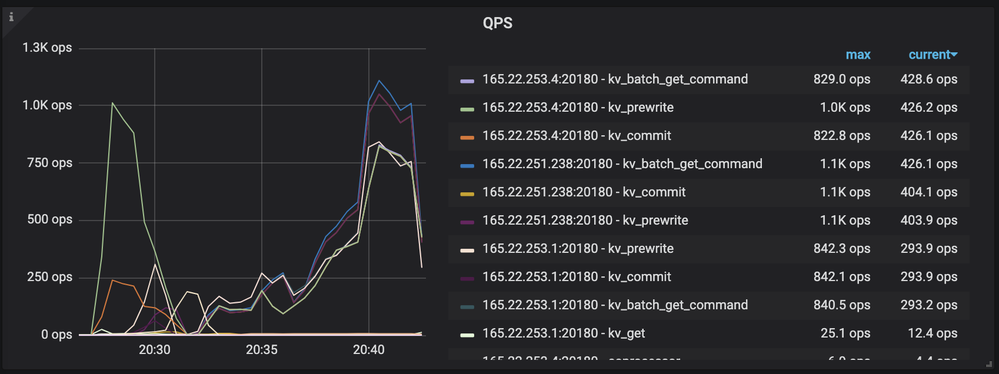

瓶颈可能在于 TiKV 上，可能与 RocksDB 或者 IO 有关。

## bulk_insert
thread 数量从 8 调大到 64，QPS 从 168923 上升到 174387。
```
[ 120s ] thds: 8 tps: 168923.92 qps: 5.80 (r/w/o: 0.00/5.80/0.00) lat (ms,95%): 0.00 err/s: 0.00 reconn/s: 0.00
[ 120s ] thds: 16 tps: 148537.74 qps: 5.10 (r/w/o: 0.00/5.10/0.00) lat (ms,95%): 0.00 err/s: 0.00 reconn/s: 0.00
[ 120s ] thds: 32 tps: 187120.26 qps: 6.10 (r/w/o: 0.00/6.10/0.00) lat (ms,95%): 0.00 err/s: 0.00 reconn/s: 0.00
[ 120s ] thds: 64 tps: 174387.33 qps: 5.80 (r/w/o: 0.00/5.80/0.00) lat (ms,95%): 0.00 err/s: 0.00 reconn/s: 0.00
```

监控截图:
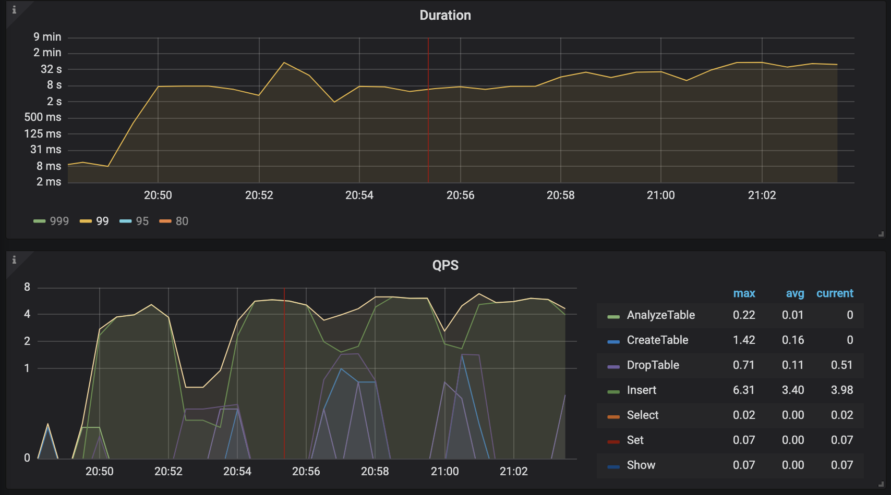
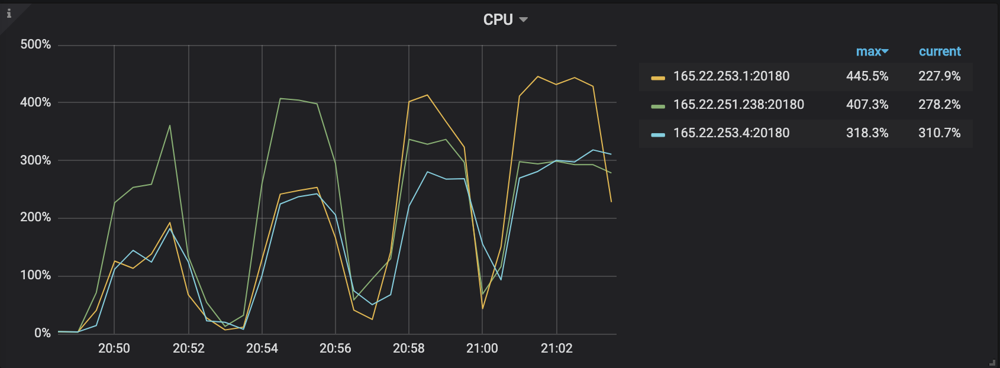
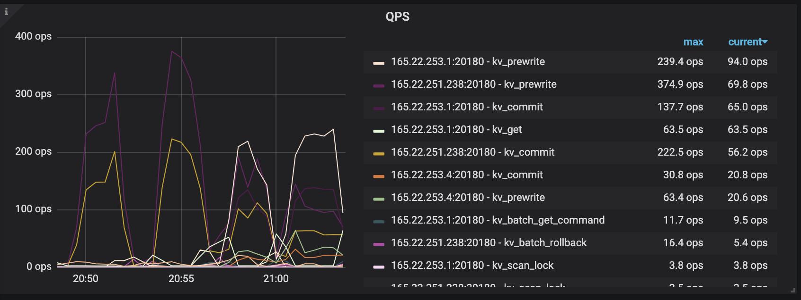
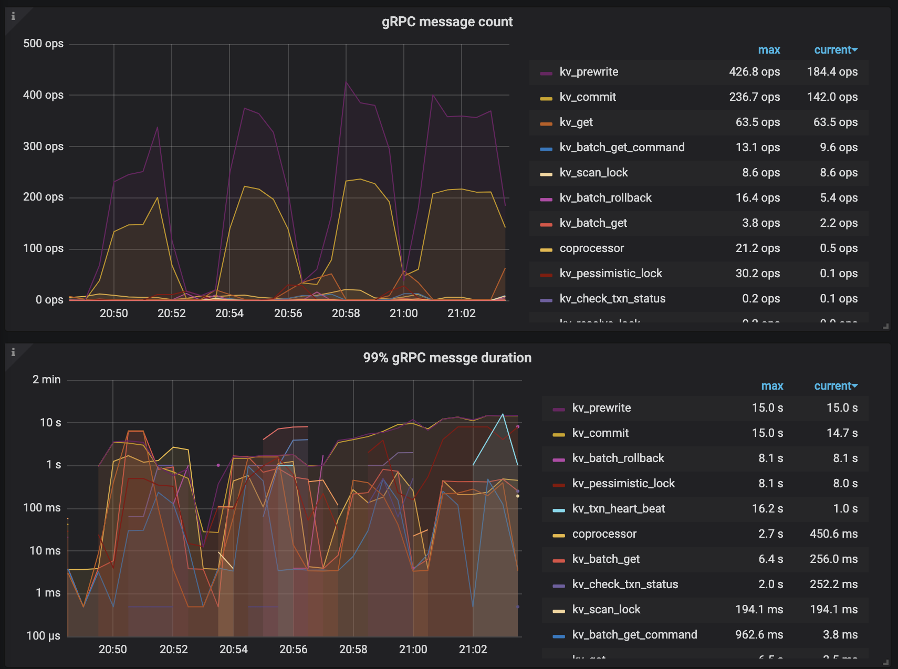
瓶颈可能在于 TiKV 上，可能与 RocksDB 或者 IO 有关。

sysbench 中未执行的测试: oltp_read_only, oltp_read_write, oltp_write_only, select_random_points, select_random_ranges。


# go-ycsb
## workloada 结果
```txt
Run finished, takes 10.498999555s
READ   - Takes(s): 10.5, Count: 517, OPS: 49.3, Avg(us): 2124, Min(us): 1461, Max(us): 6819, 99th(us): 4000, 99.9th(us): 7000, 99.99th(us): 7000
UPDATE - Takes(s): 10.5, Count: 483, OPS: 46.1, Avg(us): 19411, Min(us): 7126, Max(us): 840349, 99th(us): 131000, 99.9th(us): 841000, 99.99th(us): 841000
```

## workloadb 结果
```txt
Run finished, takes 2.104958855s
READ   - Takes(s): 2.1, Count: 934, OPS: 444.7, Avg(us): 1677, Min(us): 1144, Max(us): 6974, 99th(us): 3000, 99.9th(us): 7000, 99.99th(us): 7000
UPDATE - Takes(s): 2.1, Count: 66, OPS: 31.9, Avg(us): 7939, Min(us): 6339, Max(us): 16428, 99th(us): 17000, 99.9th(us): 17000, 99.99th(us): 17000
```

## workloadc 结果
```txt
Run finished, takes 1.79157677s
READ   - Takes(s): 1.8, Count: 1000, OPS: 559.1, Avg(us): 1777, Min(us): 1231, Max(us): 9076, 99th(us): 3000, 99.9th(us): 9000, 99.99th(us): 10000
```

## workloadd 结果
```txt
Run finished, takes 2.168015872s
INSERT - Takes(s): 2.1, Count: 59, OPS: 27.6, Avg(us): 7779, Min(us): 6399, Max(us): 16558, 99th(us): 17000, 99.9th(us): 17000, 99.99th(us): 17000
READ   - Takes(s): 2.2, Count: 941, OPS: 434.9, Avg(us): 1796, Min(us): 1105, Max(us): 9658, 99th(us): 3000, 99.9th(us): 10000, 99.99th(us): 10000
```

## workloade 结果
```txt
Run finished, takes 2.664580016s
INSERT - Takes(s): 2.6, Count: 37, OPS: 14.2, Avg(us): 7152, Min(us): 6134, Max(us): 8525, 99th(us): 9000, 99.9th(us): 9000, 99.99th(us): 9000
SCAN   - Takes(s): 2.7, Count: 963, OPS: 361.9, Avg(us): 2474, Min(us): 1754, Max(us): 12870, 99th(us): 5000, 99.9th(us): 13000, 99.99th(us): 13000
```

## workloadf 结果
```txt
Run finished, takes 5.486332174s
READ   - Takes(s): 5.5, Count: 1000, OPS: 182.4, Avg(us): 1836, Min(us): 1225, Max(us): 4002, 99th(us): 3000, 99.9th(us): 4000, 99.99th(us): 5000
READ_MODIFY_WRITE - Takes(s): 5.5, Count: 504, OPS: 92.1, Avg(us): 9053, Min(us): 7067, Max(us): 16289, 99th(us): 13000, 99.9th(us): 17000, 99.99th(us): 17000
UPDATE - Takes(s): 5.5, Count: 504, OPS: 92.1, Avg(us): 7183, Min(us): 5596, Max(us): 14610, 99th(us): 11000, 99.9th(us): 15000, 99.99th(us): 15000
```

监控截图:
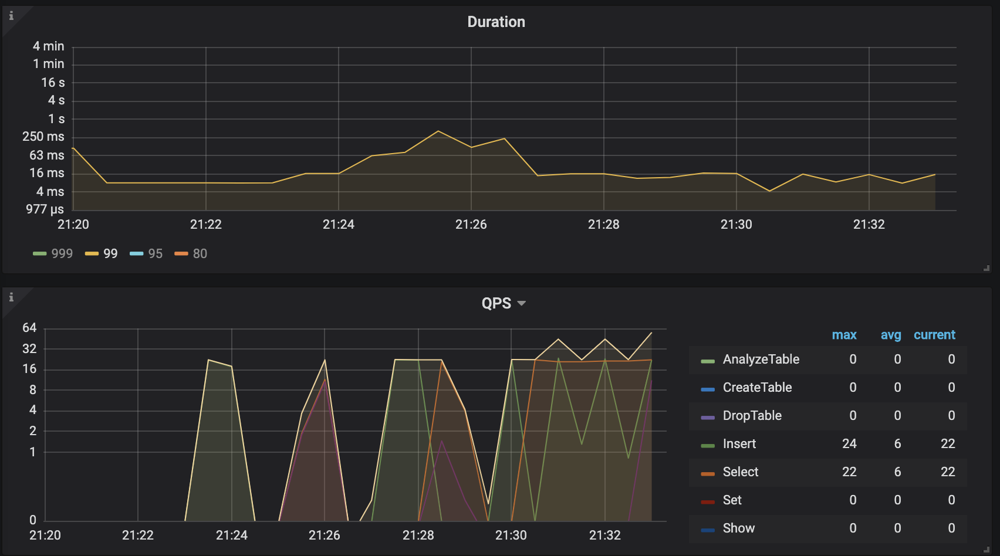
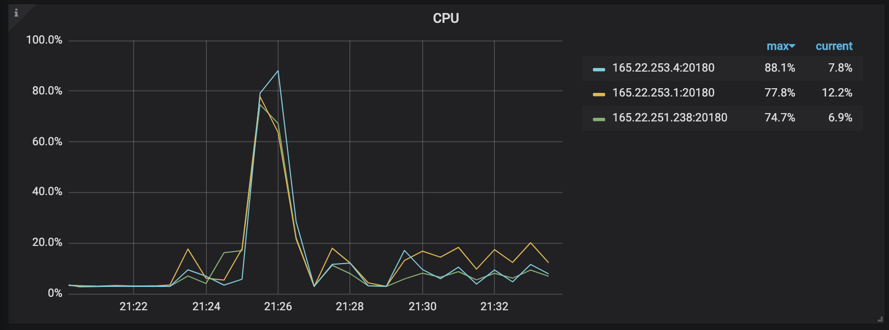

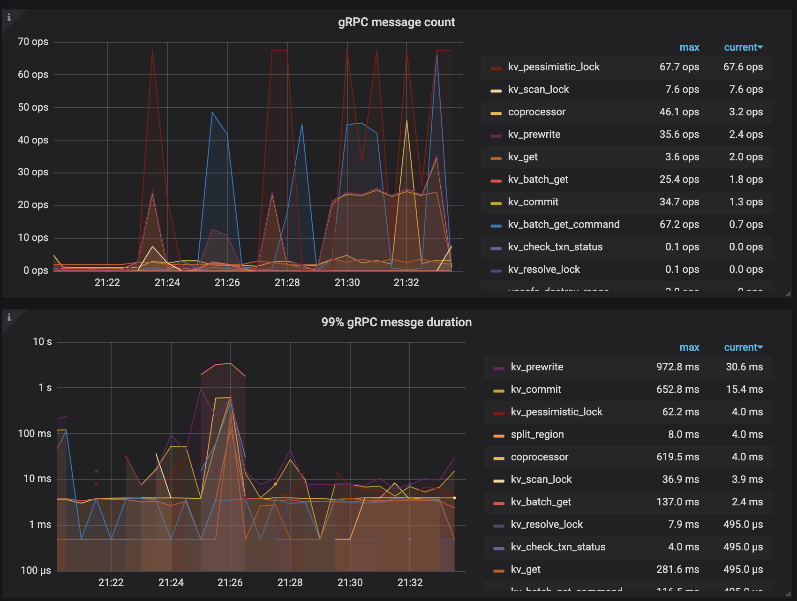

以上 workload 太少，离性能瓶颈太遥远。

# go-tpc
## tpcc
warehouse=8, 运行时间指定为 4min。
只显示如下结果：
```txt
# 16 线程, 5251.2
NEW_ORDER - Takes(s): 239.8, Count: 20990, TPM: 5251.2, Sum(ms): 1703060, Avg(ms): 81, 95th(ms): 160, 99th(ms): 512, 99.9th(ms): 1000
# 32 线程, 7434.6
NEW_ORDER - Takes(s): 239.7, Count: 29707, TPM: 7434.6, Sum(ms): 2994482, Avg(ms): 100, 95th(ms): 256, 99th(ms): 512, 99.9th(ms): 1000
# 64 线程, 8362.9
NEW_ORDER - Takes(s): 239.6, Count: 33393, TPM: 8362.9, Sum(ms): 5681413, Avg(ms): 170, 95th(ms): 1000, 99th(ms): 1000, 99.9th(ms): 1500
```

监控截图:
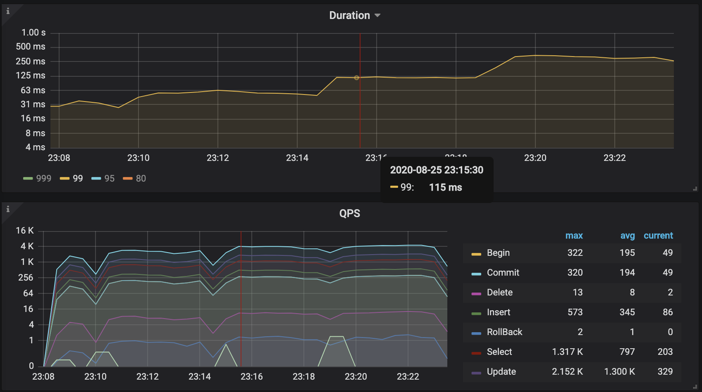
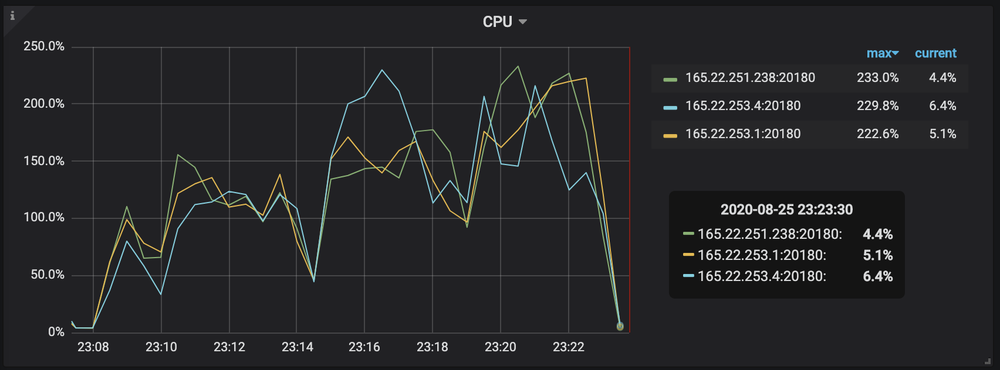

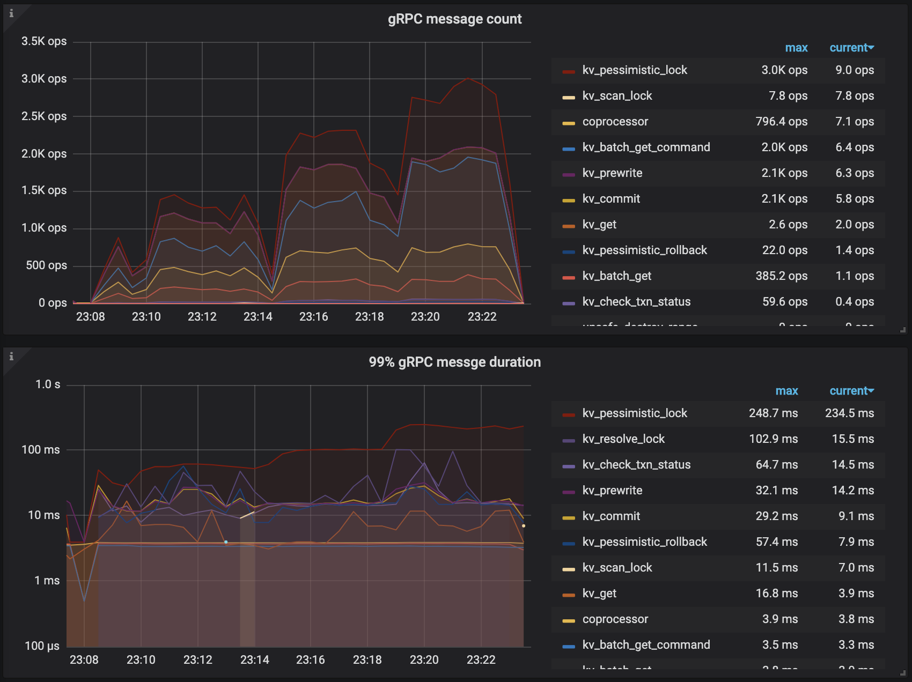

瓶颈可能在于 TiKV 的 IO 方面。

## tpch
未来得及测试。
