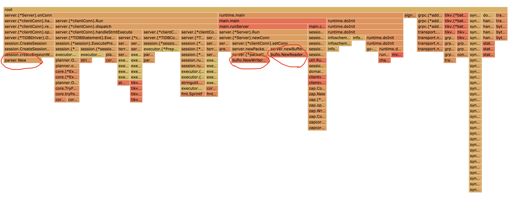

Week03 Homework Answer
======================
@yfaming, 2020.08.30 周日

# homework
分值：1 个有效 issue 100，有效 PR 根据实际效果进行相应加分，比如能节省 CPU、减少内存占用、减少 IO 次数等。

题目描述：

使用上一节可以讲的 sysbench、go-ycsb 或者 go-tpc 对 TiDB 进行压力测试，然后对 TiDB 或 TiKV 的 CPU 、内存或 IO 进行 profile，寻找潜在可以优化的地方并提 enhance 类型的 issue 描述。

issue 描述应包含：
* 部署环境的机器配置（CPU、内存、磁盘规格型号），拓扑结构（TiDB、TiKV 各部署于哪些节点）
* 跑的 workload 情况
* 对应的 profile 看到的情况
* 建议如何优化？
* 【可选】提 PR 进行优化：按照 PR 模板提交优化 PR

输出：对 TiDB 或 TiKV 进行 profile，写文章描述分析的过程，对于可以优化的地方提 issue 描述，并将 issue 贴到文章中（或【可选】提 PR 进行优化，将 PR 贴到文章中）

截止时间：9.1 24:00（逾期提交不给分)


# 机器配置
* 6 CPU
* 16GB RAM
* 320GB SSD
* $80/month

从 digitalocean 购买以上规格虚拟机 6 台。

IP 如下
```
165.232.114.199 tiprof-01
165.22.92.3 tiprof-02
165.22.89.166 tiprof-03
165.22.31.113 tiprof-04
165.22.24.134 tiprof-05
165.22.20.115 tiprof-06
```

# TiDB 集群拓扑结构
```
PD: 1 节点, tiprof-01
TiDB: 2 节点, tiprof-02, tiprof-03
TiKV: 3 节点, tiprof-04, tiprof-05, tiprof-06
```

topology.yaml
```
global:
  user: "root"
  ssh_port: 22
  deploy_dir: "/tidb-deploy"
  data_dir: "/tidb-data"

pd_servers:
  - host: 165.232.114.199

tidb_servers:
  - host: 165.22.92.3
  - host: 165.22.89.166

tikv_servers:
  - host: 165.22.31.113
  - host: 165.22.24.134
  - host: 165.22.20.115

monitoring_servers:
  - host: 165.232.114.199

grafana_servers:
  - host: 165.232.114.199

alertmanager_servers:
  - host: 165.232.114.199
```

# 获取 profile 数据的方法

针对 TiDB 实例 tiprof-02(165.22.92.3) 运行 sysbench 的 oltp_point_select 测试，同时在两台机器上发起，稳定时 tiprof-02
的 CPU Load 达到 5.0 左右。

测试运行过程中，通过 `curl http://165.22.92.3:10080/debug/zip?seconds=60 --output debug.zip` 获取 profile 数据。

# 发现的可能的内存优化点

内存火焰图如下:



图中圈出来的三处，看似是比较简单的函数调用，但在火焰图上展示的宽度略微突出。其分别为:

* `parser.New`
* `bufio.NewWriterSize`
* `bufio.NewReaderSize`

`parser.New` 对应 https://github.com/pingcap/parser/blob/master/yy_parser.go#L88-L99 ，将 `Parser` struct 的类型为 `[][]yySymType` 的
`cache` 字段的大小指定为 200，导致了较多的内存分配。一般来说 SQL 语句比较短，200 存在一定的浪费，可考虑将之调小。

`bufio.NewWriterSize` 对应 https://github.com/pingcap/tidb/blob/master/server/packetio.go#L69-L72 ，这里使用的 defaultWriterSize 为 16KB。
DB 返回的数据常常较多，这里应该没什么问题。

而 `bufio.NewReaderSize` 对应 https://github.com/pingcap/tidb/blob/master/server/buffered_read_conn.go#L33-L38 ，这里 defaultReaderSize 也为
16KB。但是 client 发往 TiDB server 的数据一般是 SQL 语句，大小很小，经常不超过 1KB，这里也存在一定的浪费，可考虑调小。
